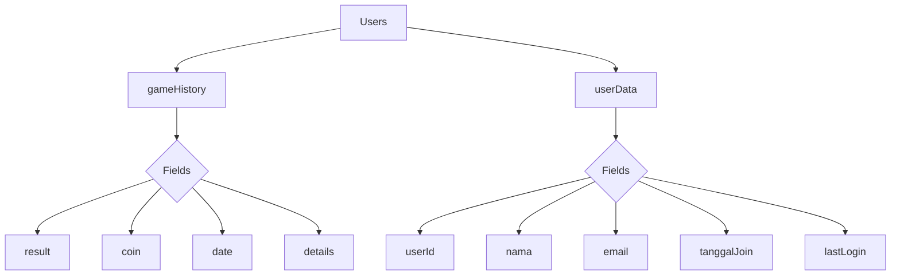

# 🎰 Simulasi Mesin Slot - Edukasi Anti Judi


**Aplikasi edukasi interaktif yang menunjukkan mekanisme di balik mesin slot dan bahaya perjudian**

## 📱 Demo Aplikasi


## 🌟 Fitur Utama

- **Simulasi Mesin Slot 4x4** dengan animasi realistis
- **Pengaturan Probabilitas Kustom**:
  - Atur persentase kemenangan (0-100%)
  - Tentukan jumlah putaran minimum sebelum bisa menang
  - Kontrol kemunculan setiap simbol
- **Sistem Poin & Riwayat Permainan**
- **Edukasi Anti Judi** dengan fakta-fakta nyata
- **Autentikasi Pengguna** dengan Firebase:
  - Login dengan Google
  - Mode tamu tanpa registrasi
  - Riwayat permainan tersinkronisasi
- **Statistik Permainan** dan analisis probabilitas

## 🛠 Teknologi

- **Flutter** - Framework utama
- **Firebase** - Backend service:
  - Firebase Auth (Autentikasi pengguna)
  - Cloud Firestore (Penyimpanan data)
- **Shared Preferences** - Penyimpanan lokal pengaturan
- **Provider** - State management
- **Animasi Lanjutan** - Untuk efek putaran mesin slot

## 📚 Latar Belakang Edukasional

Aplikasi ini dirancang untuk:
1. Menunjukkan algoritma di balik mesin slot yang selalu menguntungkan "rumah"
2. Memberikan pemahaman tentang konsep "Return to Player" (RTP) yang selalu <100%
3. Menjelaskan bahaya kecanduan judi melalui fakta nyata
4. Menunjukkan bagaimana probabilitas bekerja dalam perjudian

> "Mesin slot dirancang dengan algoritma yang memastikan pemain selalu kalah dalam jangka panjang" - Penelitian Harvard tentang Perjudian

## ⚙️ Cara Instalasi

### Prasyarat
- Flutter SDK (versi terbaru)
- Akun Firebase
- Emulator atau perangkat Android/iOS

### Langkah-langkah
1. Clone repositori:
   ```bash
   git clone https://github.com/username/simulasi-slot.git
   cd simulasi-slot
   ```

2. Install dependencies:
   ```bash
   flutter pub get
   ```

3. Setup Firebase:
   - Buat proyek baru di [Firebase Console](https://console.firebase.google.com/)
   - Tambahkan aplikasi Android/iOS
   - Download file konfigurasi (`google-services.json`/`GoogleService-Info.plist`)
   - Letakkan di folder `android/app` atau `ios/Runner`

4. Jalankan aplikasi:
   ```bash
   flutter run
   ```

## 🎮 Cara Penggunaan

1. **Pilih mode**:
   - Login dengan Google untuk menyimpan riwayat
   - Gunakan mode tamu untuk mencoba tanpa akun

2. **Atur probabilitas**:
   - Buka halaman pengaturan
   - Sesuaikan:
     - Persentase kemenangan
     - Putaran minimum
     - Frekuensi simbol

3. **Mainkan mesin slot**:
   - Tekan tombol "PUTAR"
   - Setiap putaran mengurangi 10 poin
   - Dapatkan kombinasi pemenang untuk poin tambahan

4. **Pelajari edukasi anti judi**:
   - Baca fakta-fakta bahaya perjudian
   - Pahami bagaimana mesin slot dirancang

## 📊 Struktur Database



## 🤝 Berkontribusi

Kontribusi terbuka! Berikut cara berkontribusi:

1. Fork repositori
2. Buat branch baru (`git checkout -b fitur-baru`)
3. Commit perubahan (`git commit -am 'Tambahkan fitur baru'`)
4. Push ke branch (`git push origin fitur-baru`)
5. Buat Pull Request

## 📜 Lisensi

Proyek ini dilisensikan di bawah [MIT License](LICENSE) - lihat file [LICENSE](LICENSE) untuk detail lengkap.

---

**Disclaimer**: Aplikasi ini dibuat semata-mata untuk tujuan edukasi dan pencegahan perjudian. Kami tidak mendukung atau menganjurkan aktivitas perjudian dalam bentuk apapun.